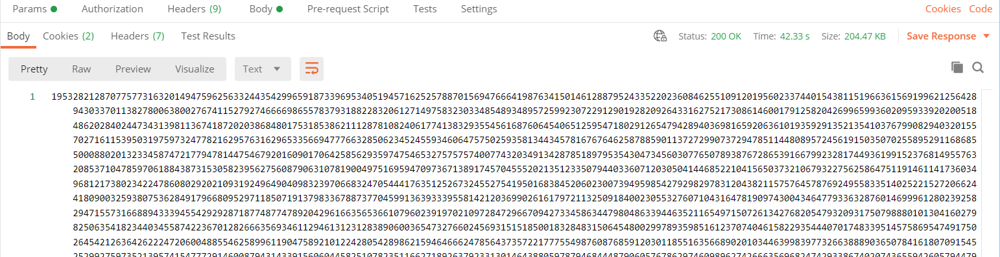

### Escuela Colombiana de Ingeniería
### Arquitecturas de Software - ARSW

## Escalamiento en Azure con Maquinas Virtuales, Sacale Sets y Service Plans

### Dependencias
* Cree una cuenta gratuita dentro de Azure. Para hacerlo puede guiarse de esta [documentación](https://azure.microsoft.com/en-us/free/search/?&ef_id=Cj0KCQiA2ITuBRDkARIsAMK9Q7MuvuTqIfK15LWfaM7bLL_QsBbC5XhJJezUbcfx-qAnfPjH568chTMaAkAsEALw_wcB:G:s&OCID=AID2000068_SEM_alOkB9ZE&MarinID=alOkB9ZE_368060503322_%2Bazure_b_c__79187603991_kwd-23159435208&lnkd=Google_Azure_Brand&dclid=CjgKEAiA2ITuBRDchty8lqPlzS4SJAC3x4k1mAxU7XNhWdOSESfffUnMNjLWcAIuikQnj3C4U8xRG_D_BwE). Al hacerlo usted contará con $200 USD para gastar durante 1 mes.

### Parte 0 - Entendiendo el escenario de calidad

Adjunto a este laboratorio usted podrá encontrar una aplicación totalmente desarrollada que tiene como objetivo calcular el enésimo valor de la secuencia de Fibonnaci.

**Escalabilidad**
Cuando un conjunto de usuarios consulta un enésimo número (superior a 1000000) de la secuencia de Fibonacci de forma concurrente y el sistema se encuentra bajo condiciones normales de operación, todas las peticiones deben ser respondidas y el consumo de CPU del sistema no puede superar el 70%.

### Escalabilidad Serverless (Functions)

1. Cree una Function App tal cual como se muestra en las  imagenes.

2. Instale la extensión de **Azure Functions** para Visual Studio Code.

3. Despliegue la Function de Fibonacci a Azure usando Visual Studio Code. La primera vez que lo haga se le va a pedir autenticarse, siga las instrucciones.

4. Dirijase al portal de Azure y pruebe la function.

5. Modifique la coleción de POSTMAN con NEWMAN de tal forma que pueda enviar 10 peticiones concurrentes. Verifique los resultados y presente un informe.

6. Cree una nueva Function que resuleva el problema de Fibonacci pero esta vez utilice un enfoque recursivo con memoization. Pruebe la función varias veces, después no haga nada por al menos 5 minutos. Pruebe la función de nuevo con los valores anteriores. ¿Cuál es el comportamiento?.

- primera prueba con 10 solicitudes 

- primera prueba despues de la espera

- segunda prueba

- segunda preuba despues de espera 

- estados del sistema

**Preguntas**

* ¿Qué es un Azure Function?Prepare sus activos de código para el futuro: los clientes que quieran experimentar las funciones como servicio incluso antes de comprometerse con la nube, también encontrarán este tiempo de ejecución muy útil. Los activos de código que crean en las instalaciones se pueden traducir fácilmente a la nube cuando finalmente se muevan.

-es quien permite la ejecucion de  fragmentos de código (funciones) sin preocuparse por la infraestructura de la aplicación. Con Azure Functions, la infraestructura en la nube proporciona todos los servidores actualizados que necesita para mantener su aplicación funcionando a escala.

* ¿Qué es serverless?

-La computación sin servidor (o serverless para abreviar) es un modelo de ejecución en el que el proveedor en la nube (AWS, Azure o Google Cloud) es responsable de ejecutar un fragmento de código mediante la asignación dinámica de los recursos. Y cobrando solo por la cantidad de recursos utilizados para ejecutar el código. El código, generalmente, se ejecuta dentro de contenedores sin estado que pueden ser activados por una variedad de eventos que incluyen solicitudes HTTP, eventos de base de datos, servicios de colas, alertas de monitoreo, carga de archivos, eventos programados (trabajos cron), etc.

* ¿Qué es el runtime y que implica seleccionarlo al momento de crear el Function App?

-Proporciona una nueva forma para que los clientes aprovechen el modelo de programación de Funciones en las instalaciones. Construido sobre las mismas raíces de código abierto en las que se basa el servicio Azure Functions, Azure Functions Runtime se puede implementar en las instalaciones y proporciona una experiencia de desarrollo casi similar a la del servicio en la nube.

-Aproveche la potencia informática no utilizada: proporciona una forma económica para que los clientes realicen determinadas tareas, como aprovechar la potencia informática de las PC locales para ejecutar procesos por lotes durante la noche, aprovechar los dispositivos en el piso para enviar datos condicionalmente a la nube, etc.

-Prepare sus activos de código para el futuro: los clientes que quieran experimentar las funciones como servicio incluso antes de comprometerse con la nube, también encontrarán este tiempo de ejecución muy útil. Los activos de código que crean en las instalaciones se pueden traducir fácilmente a la nube cuando finalmente se muevan.

* ¿Por qué es necesario crear un Storage Account de la mano de un Function App?

-Porque Contiene todos los objetos de datos de Azure Storage: blobs, archivos, colas, tablas y discos. La cuenta de almacenamiento proporciona un espacio de nombres único para sus datos de Azure Storage al que se puede acceder desde cualquier lugar del mundo a través de HTTP o HTTPS. Los datos de su cuenta de almacenamiento de Azure son duraderos y de alta disponibilidad, seguros y escalables de forma masiva

* ¿Cuáles son los tipos de planes para un Function App?, ¿En qué se diferencias?, mencione ventajas y desventajas de cada uno de ellos.

El plan Prémium admite las características siguientes:
- Duración de la ejecución ilimitada (60 minutos garantizados)
- Conectividad de red virtual
- Tamaños de la instancia Prémium (un núcleo, dos núcleos y cuatro instancias de núcleo)
- Precios más previsibles
- Asignación de aplicaciones de alta densidad para planes con varias aplicaciones de funciones

Plan dedicado: Sus aplicaciones de funciones también pueden ejecutarse en las mismas máquinas virtuales dedicadas que otras aplicaciones de App Service (SKU básica, estándar, prémium y aislada).

Considere el plan de App Service en las situaciones siguientes:

- Tiene máquinas virtuales infrautilizadas que ya ejecutan otras instancias de App Service.
- Quiere proporcionar una imagen personalizada en la que ejecutar sus funciones.

* ¿Por qué la memoization falla o no funciona de forma correcta?

-Al ejecutar valores tan grandes la aplicación arrojo error debido a problemas de rango ya que excede el límite de recursión.

* ¿Cómo funciona el sistema de facturación de las Function App?

-Está dada por el consumo de recursos y por la cantidad y tiempo de las ejeciones efectuadas.

Precios de Azure Functions

El plan de consumo de Azure Functions se factura en función del consumo de recursos y las ejecuciones por segundo. Los precios del plan de consumo incluyen una concesión gratuita mensual de 1 millones de solicitudes y 400.000 GB-segundos de consumo de recursos por suscripción en el modelo de precios de pago por uso, para todas las aplicaciones de funciones de esa suscripción. El plan Azure Functions Premium proporciona un rendimiento mejorado y se factura por segundo en función del número de vCPU/s y de GB/s que consuman sus funciones premium. Los clientes también puede ejecutar Functions dentro de su plan de App Service a las tarifas normales del plan de App Service.

* Informe

Una vez que se haya creado el ambiente de trabajo para ejecutar newman, ejecutamos las peticiones recurrentes, el resultado fue el siguiente:

Como podemos ver, la cantidad de tiempo usado para realizar las peticiones en promedio fue de 17 min, esto nos indica que la función se demora bastante en realizar el calculo de la secuencia de fibonacci para un valor de 1000000, adicionelmente, vemos que ninguna de las peticiones falló, lo cual indica un alto grado de confiabilidad por parte del servicio.

- Despues de la memorizacion:
- primera ejecucion:

- ejecucion despues de la espera:

Conclusion:

Como se observa la función resulve el problema en menos tiempo, por otro lado, al haber un sistema de almecenamento en el algoritmo, este permite responder la socitudes siguientes mucho mas rapido. Cuando volvemos a realizar las mismas peticiones después de 5 minutos, la respuesta es mucho más rápida.

